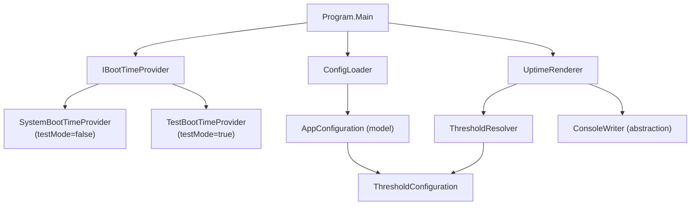

# Design Document

## Overview

The `dotnet-uptime-tracker` is a .NET 10 console application that reads the OS boot time, displays it once, and then continuously refreshes a live uptime counter in-place on the same console line. It reads threshold configuration from a JSON file (`uptime-tracker.json`) located alongside the executable and applies color changes — warn (yellow), reboot (red), or overdue (flashing) — based on how long the system has been running. The highest matching threshold always wins. The application exits cleanly on Ctrl+C, restoring the original console colors.

Key design goals:
- **Single-file, minimal-dependency** — no NuGet packages beyond the .NET 10 SDK.
- **Cross-platform** — boot time is derived from `Environment.TickCount64` (milliseconds since last boot), which works on Windows, Linux, and macOS without P/Invoke.
- **Strict fail-fast validation** — all configuration errors are caught at startup and reported with a descriptive message before any display begins.
- **Clean separation of concerns** — configuration loading/validation, boot-time retrieval, uptime formatting, color-state resolution, and console rendering are each handled by a distinct component.
- **Explicit entry point** — the project uses an explicit `Program` class with a `static async Task<int> Main(string[] args)` method. Top-level statements are not used. The `Main` method returns the process exit code directly (0 for success, 1 for configuration or runtime errors).

---

## Architecture

The application follows a linear startup sequence followed by a render loop:

```
┌─────────────────────────────────────────────────────────────────┐
│  Program                                                        │
│  static async Task<int> Main(string[] args)                     │
│                                                                 │
│  1. Locate & load uptime-tracker.json                           │
│  2. Parse & validate ThresholdConfiguration                     │
│  3. Select IBootTimeProvider based on testMode flag:            │
│     ├─ testMode=false → SystemBootTimeProvider                  │
│     └─ testMode=true  → TestBootTimeProvider (program start)    │
│  4. Retrieve BootTime via IBootTimeProvider                     │
│  5. Save original console colors                                │
│  6. Register Ctrl+C → CancellationTokenSource.Cancel()          │
│  7. Print boot-time line (static, never refreshed)              │
│     └─ If testMode=true, append " [TEST MODE]" to the line      │
│  8. Enter render loop (UptimeRenderer)                          │
│     ├─ Calculate uptime                                         │
│     ├─ Resolve ColorState via ThresholdResolver                 │
│     ├─ Write uptime string in-place                             │
│     └─ Delay 1 s (or flash half-period) via CancellationToken   │
│  9. On cancellation: restore colors, print newline, return 0    │
│  10. On ConfigurationException: write to stderr, return 1       │
└─────────────────────────────────────────────────────────────────┘
```

The entry point is an explicit `Program` class — top-level statements are not used. The `Main` method signature is:

```csharp
internal sealed class Program
{
    public static async Task<int> Main(string[] args)
    {
        // ...
    }
}
```

`Main` returns the exit code as an `int` (0 = success, 1 = error). The .NET runtime sets the process exit code from this return value, so `Environment.Exit` is not called directly.

### Component Diagram



---

## Components and Interfaces

### ConfigLoader

Responsible for locating, reading, deserializing, and validating `uptime-tracker.json`.

```csharp
internal static class ConfigLoader
{
    /// <summary>
    /// Loads and validates the application configuration from the file next to the executable.
    /// Returns an AppConfiguration containing the ThresholdConfiguration and the testMode flag.
    /// Throws ConfigurationException with a descriptive message on any error.
    /// </summary>
    public static AppConfiguration Load(string executableDirectory);
}
```

Validation steps (in order):
1. File existence check → exit code 1 if missing.
2. JSON deserialization (using `System.Text.Json`).
3. Presence of all three keys (`warn`, `reboot`, `overdue`).
4. `after` field present and parseable as `HH:MM:SS` with no negative components.
5. ConsoleColor name validation for all optional color fields (case-insensitive `Enum.TryParse`).
6. Ascending order: `warn.after < reboot.after < overdue.after`.
7. `testMode` is read as an optional boolean; absent or `false` → `TestMode = false`; `true` → `TestMode = true`. No other values are valid.

### BootTimeProvider

Abstracts OS boot-time retrieval to allow unit testing.

```csharp
internal interface IBootTimeProvider
{
    /// <summary>Returns the local date/time at which the OS last booted.</summary>
    DateTime GetBootTime();
}

internal sealed class SystemBootTimeProvider : IBootTimeProvider
{
    public DateTime GetBootTime()
    {
        // Cross-platform: subtract milliseconds-since-boot from current local time.
        return DateTime.Now - TimeSpan.FromMilliseconds(Environment.TickCount64);
    }
}

internal sealed class TestBootTimeProvider : IBootTimeProvider
{
    private readonly DateTime _startTime;

    /// <param name="startTime">The program start time captured at application startup (e.g., DateTime.Now).</param>
    public TestBootTimeProvider(DateTime startTime)
    {
        _startTime = startTime;
    }

    public DateTime GetBootTime() => _startTime;
}
```

`Environment.TickCount64` is available on all .NET 10 target platforms (Windows, Linux, macOS) and does not require P/Invoke. It returns the number of milliseconds elapsed since the last OS boot.

`Program.Main` captures `DateTime.Now` as the program start time before any other work is done. When `testMode` is `true` in the loaded configuration, a `TestBootTimeProvider` is constructed with that captured start time and used in place of `SystemBootTimeProvider`. This means uptime begins counting from zero at application launch, making it straightforward to observe all color threshold transitions within a short session.

### ThresholdResolver

Pure function that maps a `TimeSpan` uptime to a `ColorState`.

```csharp
internal static class ThresholdResolver
{
    public static ColorState Resolve(TimeSpan uptime, ThresholdConfiguration config, int flashTick);
}
```

Resolution logic (highest threshold wins):
1. If `uptime >= overdue.after` → `ColorState.Overdue(flashTick % 2)`
2. Else if `uptime >= reboot.after` → `ColorState.Reboot`
3. Else if `uptime >= warn.after` → `ColorState.Warn`
4. Else → `ColorState.Default`

`flashTick` is an integer incremented each render cycle regardless of the configured Flash_Interval; `flashTick % 2` selects which `Flash_Pair` to apply. The Flash_Interval controls the delay between ticks (and therefore the visible duration of each pair), not the tick count itself.

### UptimeRenderer

Owns the render loop. Writes the uptime string in-place using `Console.SetCursorPosition`.

```csharp
internal sealed class UptimeRenderer
{
    public UptimeRenderer(
        IBootTimeProvider bootTimeProvider,
        ThresholdConfiguration config,
        IConsoleWriter consoleWriter,
        bool testMode = false);

    public Task RunAsync(CancellationToken cancellationToken);
}
```

Render loop behavior:
- Records the cursor row after the boot-time line is printed.
- Each iteration: compute uptime → resolve color state → set cursor to saved row, column 0 → apply colors → write formatted uptime string → reset colors → delay.
- Flash cycle: when in overdue state the loop delay is `config.Overdue.FlashIntervalMs` milliseconds (default 1000 ms), so a full cycle (pair A → pair B → pair A) completes in two Flash_Interval periods. When not in overdue state the delay is a fixed 1000 ms.
- Uses `Task.Delay(config.Overdue.FlashIntervalMs, cancellationToken)` (overdue) or `Task.Delay(1000, cancellationToken)` (non-overdue) so Ctrl+C wakes the delay immediately.

The boot-time line is printed by `Program.Main` before `UptimeRenderer.RunAsync` is called. When `testMode` is `true`, `Program.Main` appends ` [TEST MODE]` to the boot-time line so the operator can see at a glance that the displayed time is the program start time, not the real OS boot time.

### IConsoleWriter

Thin abstraction over `System.Console` to enable unit testing without real console I/O.

```csharp
internal interface IConsoleWriter
{
    void SetCursorPosition(int left, int top);
    int CursorTop { get; }
    void Write(string value);
    void WriteLine(string value);
    void WriteLine();
    ConsoleColor ForegroundColor { get; set; }
    ConsoleColor BackgroundColor { get; set; }
    void ResetColor();
}
```

The production implementation delegates directly to `System.Console`. Tests inject a fake.

### UptimeFormatter

Pure static helper that converts a `TimeSpan` to the display string.

```csharp
internal static class UptimeFormatter
{
    /// <summary>Formats uptime as "Xd HHh MMm SSs", e.g. "3d 04h 22m 11s".</summary>
    public static string Format(TimeSpan uptime);
}
```

### ConfigurationException

A dedicated exception type used by `ConfigLoader` to carry a user-facing error message and a non-zero exit code.

```csharp
internal sealed class ConfigurationException : Exception
{
    public int ExitCode { get; } = 1;
    public ConfigurationException(string message) : base(message) { }
}
```

---

## Data Models

### AppConfiguration

Top-level configuration model that wraps `ThresholdConfiguration` and carries the `testMode` flag.

```csharp
internal sealed record AppConfiguration(
    ThresholdConfiguration Thresholds,
    bool TestMode   // default: false
);
```

`ConfigLoader.Load` returns an `AppConfiguration`. `Program.Main` reads `TestMode` from it to select the appropriate `IBootTimeProvider` and to decide whether to append `[TEST MODE]` to the boot-time line.

### ThresholdConfiguration

```csharp
internal sealed record ThresholdConfiguration(
    WarnThreshold Warn,
    RebootThreshold Reboot,
    OverdueThreshold Overdue
);
```

### WarnThreshold / RebootThreshold

```csharp
internal sealed record WarnThreshold(
    TimeSpan After,
    ConsoleColor Foreground,   // default: Yellow
    ConsoleColor? Background   // default: null (use console default)
);

internal sealed record RebootThreshold(
    TimeSpan After,
    ConsoleColor Foreground,   // default: Red
    ConsoleColor? Background   // default: null
);
```

### OverdueThreshold

```csharp
internal sealed record OverdueThreshold(
    TimeSpan After,
    FlashPair PairA,   // default: Red fg / White bg
    FlashPair PairB,   // default: White fg / Red bg
    int FlashIntervalMs  // default: 1000
);
```

### FlashPair

```csharp
internal sealed record FlashPair(
    ConsoleColor Foreground,
    ConsoleColor Background
);
```

### ColorState (discriminated union via sealed hierarchy)

```csharp
internal abstract record ColorState
{
    public sealed record Default : ColorState;
    public sealed record Warn(ConsoleColor Foreground, ConsoleColor? Background) : ColorState;
    public sealed record Reboot(ConsoleColor Foreground, ConsoleColor? Background) : ColorState;
    public sealed record Overdue(FlashPair ActivePair) : ColorState;
}
```

### JSON deserialization DTOs

`System.Text.Json` deserializes into intermediate DTO records (with nullable fields) before validation converts them to the strongly-typed model above. This keeps validation logic separate from deserialization.

```csharp
// Raw JSON shape — all fields nullable for validation purposes
internal sealed record RawConfig(
    bool? TestMode,
    RawThreshold? Warn,
    RawThreshold? Reboot,
    RawThreshold? Overdue
);

internal sealed record RawThreshold(
    string? After,
    string? Foreground,
    string? Background,
    RawFlashPair[]? Flash,
    int? FlashIntervalMs
);

internal sealed record RawFlashPair(
    string? Foreground,
    string? Background
);
```

---

## Correctness Properties

*A property is a characteristic or behavior that should hold true across all valid executions of a system — essentially, a formal statement about what the system should do. Properties serve as the bridge between human-readable specifications and machine-verifiable correctness guarantees.*

### Property 1: Uptime format round-trip

*For any* non-negative `TimeSpan` value, `UptimeFormatter.Format` SHALL produce a string whose parsed days, hours, minutes, and seconds components exactly match the original `TimeSpan` (truncated to whole seconds).

**Validates: Requirements 2.2**

### Property 2: Threshold resolver — highest threshold wins

*For any* uptime `TimeSpan` and valid `ThresholdConfiguration`, `ThresholdResolver.Resolve` SHALL return `ColorState.Overdue` when `uptime >= overdue.after`, `ColorState.Reboot` when `reboot.after <= uptime < overdue.after`, `ColorState.Warn` when `warn.after <= uptime < reboot.after`, and `ColorState.Default` when `uptime < warn.after`.

**Validates: Requirements 4.1, 5.1, 6.1, 6.6**

### Property 3: Flash alternation within two Flash_Interval periods

*For any* valid `ThresholdConfiguration` and any sequence of consecutive `flashTick` values, the two flash pairs SHALL alternate such that a full cycle (pair A → pair B → pair A) completes within 2 render ticks, where each tick is delayed by `config.Overdue.FlashIntervalMs` milliseconds.

**Validates: Requirements 6.4**

### Property 4: Config validation rejects invalid `after` values

*For any* string that is not a valid `HH:MM:SS` duration (including strings with negative components, wrong separators, or out-of-range values), `ConfigLoader.Load` SHALL throw a `ConfigurationException`.

**Validates: Requirements 3.6**

### Property 5: Config validation rejects invalid ConsoleColor names

*For any* color field value that is not a member of `System.ConsoleColor` (case-insensitive), `ConfigLoader.Load` SHALL throw a `ConfigurationException`.

**Validates: Requirements 3.7**

### Property 6: Config validation enforces ascending threshold order

*For any* configuration where the `after` values are not strictly ascending (`warn < reboot < overdue`), `ConfigLoader.Load` SHALL throw a `ConfigurationException`.

**Validates: Requirements 3.3**

### Property 7: Render loop uses configured flash interval

*For any* valid `flashIntervalMs` value ≥ 1, when the application is in overdue state, the render loop SHALL use that value (in milliseconds) as the delay between flash pair switches.

**Validates: Requirements 6.4, 6.7**

---

## Error Handling

All errors that prevent the application from running are reported to `stderr` with a descriptive message and cause a non-zero exit code (1). No partial output is written to the console before a startup error is reported.

| Condition | Message pattern | Exit code |
|---|---|---|
| Config file not found | `Error: Configuration file not found: {path}` | 1 |
| Missing threshold key | `Error: Missing required key '{key}' in configuration file.` | 1 |
| Invalid `after` format | `Error: Invalid 'after' value '{value}' for '{key}'. Expected HH:MM:SS with non-negative components.` | 1 |
| Invalid ConsoleColor name | `Error: '{value}' is not a valid ConsoleColor name in '{key}.{field}'.` | 1 |
| Thresholds not ascending | `Error: Threshold 'after' values must be in ascending order: warn < reboot < overdue.` | 1 |
| Invalid `flashIntervalMs` | `Error: 'flashIntervalMs' in 'overdue' must be a positive integer (≥ 1). Got: {value}.` | 1 |
| Boot time unavailable | `Error: Unable to retrieve system boot time: {inner message}` | 1 |

Errors are written with `Console.Error.WriteLine` so they do not interfere with stdout redirection.

On Ctrl+C, the application exits with code 0 (normal termination).

---

## Testing Strategy

### Test Project Structure

All tests live in a separate project `UptimeTracker.Tests` that references the main project. The test project uses:
- **xUnit** — test runner and assertion framework.
- **FsCheck** and **FsCheck.Xunit** — property-based testing library.

Test classes mirror source classes: one test class per source class. Each test file is named `{SourceClass}Tests.cs` (example-based) or `{SourceClass}PropertyTests.cs` (property-based).

---

### UptimeFormatterTests (example-based)

Each test calls `UptimeFormatter.Format(TimeSpan)` and asserts the exact output string.

| Input | Expected output |
|---|---|
| `TimeSpan.Zero` | `"0d 00h 00m 00s"` |
| 1 second | `"0d 00h 00m 01s"` |
| 1 minute exactly | `"0d 00h 01m 00s"` |
| 1 hour exactly | `"0d 01h 00m 00s"` |
| 1 day exactly | `"1d 00h 00m 00s"` |
| 3 days, 4 hours, 22 minutes, 11 seconds | `"3d 04h 22m 11s"` |
| 999 days, 23 hours, 59 minutes, 59 seconds | `"999d 23h 59m 59s"` |

---

### ThresholdResolverTests (example-based)

Tests use a fixed `ThresholdConfiguration` with `warn.after = 2h`, `reboot.after = 6h`, `overdue.after = 12h` and default colors.

**Boundary tests — `ColorState` returned:**

| Uptime | Expected `ColorState` |
|---|---|
| `0s` | `Default` |
| `warn.after − 1s` (1h 59m 59s) | `Default` |
| `warn.after` (2h 0m 0s) | `Warn` |
| `warn.after + 1s` (2h 0m 1s) | `Warn` |
| `reboot.after − 1s` (5h 59m 59s) | `Warn` |
| `reboot.after` (6h 0m 0s) | `Reboot` |
| `reboot.after + 1s` (6h 0m 1s) | `Reboot` |
| `overdue.after − 1s` (11h 59m 59s) | `Reboot` |
| `overdue.after` (12h 0m 0s) | `Overdue` |
| `overdue.after + 1s` (12h 0m 1s) | `Overdue` |

**Flash alternation tests:**

| `flashTick` | Expected active pair |
|---|---|
| `0` | `PairA` |
| `1` | `PairB` |
| `2` | `PairA` |
| `3` | `PairB` |
| `100` (even) | `PairA` |
| `101` (odd) | `PairB` |

**Color configuration tests:**

- Default colors applied when no custom colors are configured in `warn` or `reboot`.
- Custom `foreground` applied when `warn.foreground` is set to a non-default `ConsoleColor`.
- Custom `background` applied when `reboot.background` is set.
- Default `FlashPair` values (Red/White, White/Red) applied when no `flash` array is configured.
- Custom `FlashPair` values applied when `flash` array is present.

---

### ConfigLoaderTests (example-based)

Each test writes a temporary JSON file (or omits it) and calls `ConfigLoader.Load(directory)`.

**Valid configurations:**

| Scenario | Expected result |
|---|---|
| Minimal config — only required fields, no optional fields | Loads successfully; defaults applied (`warn.Foreground = Yellow`, `reboot.Foreground = Red`, default flash pairs, `FlashIntervalMs = 1000`, `TestMode = false`) |
| Full config — all optional fields specified | Loads with the specified values for all fields |
| `testMode` absent | `TestMode = false` |
| `testMode: false` | `TestMode = false` |
| `testMode: true` | `TestMode = true` |
| `flashIntervalMs: 1` | Valid; `FlashIntervalMs = 1` |

**Error cases — each asserts `ConfigurationException` is thrown:**

| Scenario | Exception message must contain |
|---|---|
| Config file does not exist | File path |
| `warn` key missing | `"warn"` |
| `reboot` key missing | `"reboot"` |
| `overdue` key missing | `"overdue"` |
| `after` missing from `warn` | (ConfigurationException thrown) |
| `after` value `"abc"` (not HH:MM:SS) | (ConfigurationException thrown) |
| `after` value `"-01:00:00"` (negative component) | (ConfigurationException thrown) |
| `after` value `"00:60:00"` (minutes out of range) | (ConfigurationException thrown) |
| `warn.after >= reboot.after` | (ConfigurationException thrown) |
| `reboot.after >= overdue.after` | (ConfigurationException thrown) |
| `warn.foreground: "NotAColor"` | `"NotAColor"` |
| `reboot.background: "NotAColor"` | (ConfigurationException thrown) |
| Flash pair `foreground: "NotAColor"` | (ConfigurationException thrown) |
| `flashIntervalMs: 0` | (ConfigurationException thrown) |
| `flashIntervalMs: -1` | (ConfigurationException thrown) |

---

### UptimeRendererTests (example-based, using fakes)

Tests inject a `FakeConsoleWriter` (implements `IConsoleWriter`, records all calls) and a `FakeBootTimeProvider` (returns a fixed `DateTime`). The renderer is driven by a `CancellationToken` that is cancelled after a controlled number of ticks.

**Boot-time line tests:**

- Boot time line is written exactly once at startup (before the render loop begins).
- Boot time line contains the formatted boot time string.
- When `testMode = false`, the boot time line does NOT contain `"[TEST MODE]"`.
- When `testMode = true`, the boot time line contains `"[TEST MODE]"`.

**In-place rendering tests:**

- After the boot time line is written, subsequent uptime writes use `SetCursorPosition` to the saved row rather than appending new lines.
- The cursor column is reset to 0 on each uptime refresh.

**Color state tests (one test per state):**

| Uptime relative to thresholds | Expected console behavior |
|---|---|
| Below `warn.after` | No `ForegroundColor`/`BackgroundColor` assignment; `ResetColor` called after write |
| At or above `warn.after`, below `reboot.after` | `ForegroundColor` set to warn foreground; `ResetColor` called after write |
| At or above `reboot.after`, below `overdue.after` | `ForegroundColor` set to reboot foreground; `ResetColor` called after write |
| At or above `overdue.after`, `flashTick` even | `ForegroundColor`/`BackgroundColor` set to PairA values |
| At or above `overdue.after`, `flashTick` odd | `ForegroundColor`/`BackgroundColor` set to PairB values |

**Cancellation / cleanup tests:**

- When the `CancellationToken` is cancelled, `ResetColor` is called to restore console colors.
- When the `CancellationToken` is cancelled, a final `WriteLine()` (empty line) is written so the terminal prompt appears on a new line.
- After cancellation, no further uptime writes occur.

---

### ProgramTests (integration-style, example-based)

These tests invoke `Program.Main` directly (or via a thin wrapper) with a controlled file system and a pre-cancelled `CancellationToken`.

| Scenario | Expected exit code | Expected stderr |
|---|---|---|
| Config file does not exist | `1` | Contains error message with file path |
| Valid config, `CancellationToken` cancelled immediately | `0` | Empty |

---

### Property-Based Tests

Property-based tests use [FsCheck](https://fscheck.github.io/FsCheck/) with the `FsCheck.Xunit` integration. Each property test runs a minimum of **100 iterations**.

Tests are tagged with a comment in the format:
`// Feature: dotnet-uptime-tracker, Property {N}: {property_text}`

#### P1 — UptimeFormatterPropertyTests: Uptime format round-trip

```
// Feature: dotnet-uptime-tracker, Property 1: Uptime format round-trip
```

Generator: random `TimeSpan` in the range [0, 999 days] (whole seconds only).

For any such `TimeSpan t`, parse the output of `UptimeFormatter.Format(t)` back into days, hours, minutes, and seconds components and assert they equal `(int)t.TotalDays`, `t.Hours`, `t.Minutes`, `t.Seconds`.

#### P2 — ThresholdResolverPropertyTests: Threshold resolver priority invariant

```
// Feature: dotnet-uptime-tracker, Property 2: Threshold resolver — highest threshold wins
```

Generator: random `TimeSpan` uptime (0 to 30 days) + random valid `ThresholdConfiguration` (three strictly ascending `after` values, valid colors).

For any such pair, assert that `ThresholdResolver.Resolve` returns:
- `ColorState.Overdue` when `uptime >= overdue.after`
- `ColorState.Reboot` when `reboot.after <= uptime < overdue.after`
- `ColorState.Warn` when `warn.after <= uptime < reboot.after`
- `ColorState.Default` when `uptime < warn.after`

#### P3 — ThresholdResolverPropertyTests: Flash alternation correctness

```
// Feature: dotnet-uptime-tracker, Property 3: Flash alternation within two Flash_Interval periods
```

Generator: random sequence of consecutive `flashTick` integers (length 2–20) starting from a random non-negative integer.

For any such sequence, when uptime is in the overdue state, assert that `flashTick % 2 == 0` always yields PairA and `flashTick % 2 == 1` always yields PairB — i.e., the pair selection is purely a function of `flashTick % 2`.

#### P4 — ConfigLoaderPropertyTests: Invalid `after` strings always rejected

```
// Feature: dotnet-uptime-tracker, Property 4: Config validation rejects invalid 'after' values
```

Generator: random strings that are not valid `HH:MM:SS` durations (generated by producing arbitrary strings and filtering out the small set that happen to match the pattern).

For any such string used as the `after` value for any threshold, `ConfigLoader.Load` SHALL throw `ConfigurationException`.

#### P5 — ConfigLoaderPropertyTests: Invalid ConsoleColor strings always rejected

```
// Feature: dotnet-uptime-tracker, Property 5: Config validation rejects invalid ConsoleColor names
```

Generator: random strings that are not members of `System.ConsoleColor` (case-insensitive).

For any such string used as any color field value, `ConfigLoader.Load` SHALL throw `ConfigurationException`.

#### P6 — ConfigLoaderPropertyTests: Non-ascending threshold order always rejected

```
// Feature: dotnet-uptime-tracker, Property 6: Config validation enforces ascending threshold order
```

Generator: random `TimeSpan` triples `(a, b, c)` where the strict ascending order `a < b < c` is violated (i.e., `a >= b` or `b >= c`).

For any such triple used as `(warn.after, reboot.after, overdue.after)`, `ConfigLoader.Load` SHALL throw `ConfigurationException`.

#### P7 — UptimeRendererPropertyTests: Render loop uses configured flash interval

```
// Feature: dotnet-uptime-tracker, Property 7: Render loop uses configured flash interval
```

Generator: random valid `flashIntervalMs` values in the range [1, 10000].

For any such value, when the renderer is in overdue state, the delay passed to `Task.Delay` SHALL equal `flashIntervalMs`. Verified by injecting a fake delay provider that records the delay values used.

---

### What is NOT property-tested

Console rendering (cursor positioning, color application) is tested with example-based tests using the `IConsoleWriter` fake. The rendering behavior does not vary meaningfully with arbitrary input — it is driven by the `ColorState` value, which is already covered by property tests on `ThresholdResolver`. Similarly, `ProgramTests` uses example-based integration tests because the scenarios (missing file, immediate cancellation) are discrete cases rather than a continuous input space.
